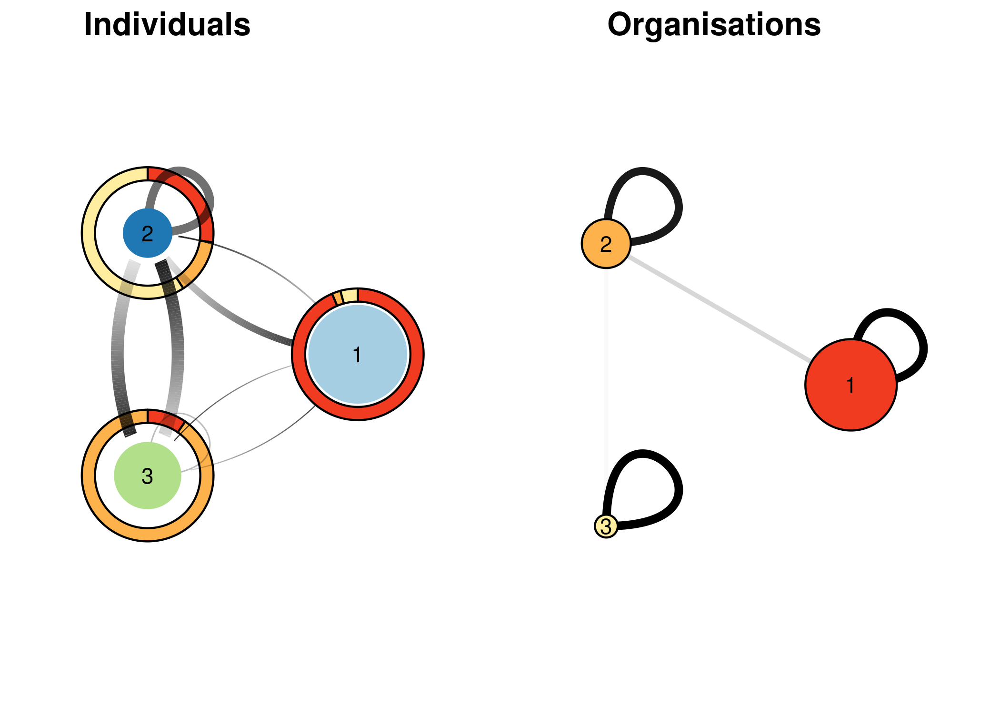

<!-- README.md is generated from README.Rmd. Please edit that file -->
MLVSBM
======

<!-- badges: start -->
[](https://travis-ci.org/Chabert-Liddell/MLVSBM) [](https://codecov.io/gh/Chabert-Liddell/MLVSBM?branch=master) <!-- badges: end -->

This is an implementation of a Stochastic Block Model for Multilevel Network (MLVSBM) as described in the following preprint: <https://arxiv.org/abs/1910.10512>

Installation
------------

You can install the released version of MLVSBM from [github](https://github.com) with:

``` r
devtools::install_github("Chabert-Liddell/MLVSBM")
```

Tutorial
--------

The package deals with multilevel network defined as the junction of two interaction network (adjacency matrices) linked by an affiliation relationship (affiliation matrix).

First, we're going to simulate a multilevel network with 100 individuals and 3 clusters of individuals for the lower level and 50 organizations and 3 clusters for the upper level. The inter-organizational level will have an assortative structure and will be undirected, the inter-individual's one a core-periphery structure and will be directed. Affiliation matrix will be generated by a power law and the dependence between the stucture of the two levels will be strong.

``` r
set.seed(123)
my_mlvsbm <- MLVSBM::mlvsbm_simulate_network(
  n = list(I = 100, O = 50), # Number of nodes for the lower level and the upper level
  Q = list(I = 3, O = 3), # Number of blocks for the lower level and the upper level
  pi = c(.5, .3, .2), # Block proportion for the upper level, must sum to one
  gamma = matrix(c(.8, .1, .1,  # Block proportion for the lower level,
                   .1, .8, .1,
                   .1, .1, .8), # each column must sum to one
                 nrow = 3, ncol = 3, byrow = TRUE),  
  alpha = list(I = matrix(c(.1, .1, .3, 
                            .1, .2, .5,
                            .1, .5, .5), 
                          nrow = 3, ncol = 3, byrow = TRUE), # Connection matrix
               O = matrix(c(.5, .1, .1, 
                            .1, .5, .1,
                            .1, .1, .5), 
                          nrow = 3, ncol = 3, byrow = TRUE)),# between blocks
  directed = list(I = TRUE, O = FALSE), # Are the upper and lower level directed or not ?
  affiliation = "preferential", # How the affiliation matrix is generated
  no_empty_org = FALSE) # May the affiliation matrix have column suming to 0
#> alpha[[1]] is not symmetric but level is directed!!!
```

The network is stocked in an R6 object of type MLVSBM.

Now, we are going to create a multilevel network object from 2 existing adjacency matrix and an affiliation matrix :

``` r
lower_level <- my_mlvsbm$adjacency_matrix$I # matrix of size nI x nI
upper_level <- my_mlvsbm$adjacency_matrix$O # matrix of size nO x nO
affiliation <- my_mlvsbm$affiliation_matrix # matrix of size nI x nO
my_mlvsbm2 <- MLVSBM::mlvsbm_create_network(X = list(I = lower_level, O = upper_level),
                                            A = affiliation)
```

We can now infer the parameters, blocks and edge probabilities of our network by using the mlvlsbm\_esimate\_network function on an MLVSBM object. It will return the best model for this network as another R6 object of type FitMLVSBM.

``` r
fit <- MLVSBM:::mlvsbm_estimate_network(my_mlvsbm)
#> [1] "Infering lower level :"
#> [1] "# cluster : 1, ICL = -4887.05674111248 !"
#> [1] "# cluster : 2, ICL = -4804.99021954573 !"
#> [1] "# cluster : 3, ICL = -4660.50928166488 !"
#> [1] "# cluster : 2, ICL = -4598.95889897355 !"
#> [1] "# cluster : 5, ICL = -4701.28622891318 !"
#> [1] "# cluster : 4, ICL = -4587.60800963499 !"
#> [1] "# cluster : 3, ICL = -4488.25919549706 !"
#> [1] "Infering upper level :"
#> [1] "# cluster : 1, ICL = -699.732829123695 !"
#> [1] "# cluster : 2, ICL = -655.852064636327 !"
#> [1] "# cluster : 3, ICL = -625.901870227343 !"
#> [1] "# cluster : 2, ICL = -624.784594377997 !"
#> [1] "# cluster : 3, ICL = -623.96254347691 !"
#> [1] "# cluster : 5, ICL = -666.926581692393 !"
#> [1] "# cluster : 4, ICL = -640.831005661602 !"
#> [1] "# cluster : 3, ICL = -623.035833937817 !"
#> [1] "======= # Individual clusters : 3 , # Organisation clusters 3,  ICL : -5002.74498144572========"
#> [1] "======= # Individual clusters : 3 , # Organisation clusters 2,  ICL : -4995.34282943409========"
#> [1] "======= # Individual clusters : 3 , # Organisation clusters 3,  ICL : -4976.33718935498========"
#> [1] "======= # Individual clusters : 3 , # Organisation clusters 3,  ICL : -4976.33718935498========"
#> [1] "ICL for independent levels : -5111.29502943488"
#> [1] "ICL for interdependent levels : -4976.33718935498"
#> [1] "=====Interdepence is detected between the two level====="
```

Ploting the results
-------------------

We can plot some synthetic view of the network :

Plotting adjacency matrices reordered by block with the link probability of each observed link.

``` r
ggdraw()+
  draw_plot(
    t(fit$X_hat$I * lower_level) %>% 
      as_tbl_graph() %>% 
      mutate(group = fit$Z$I) %>% 
      ggraph('matrix', sort.by = group)+
      geom_edge_point(aes(color = weight))+
      scale_edge_color_gradient(name = 'Prob', low = "#deebf7", high = "#08519c") +
      geom_hline(yintercept = cumsum(table(fit$Z$I))[-fit$nb_clusters$I]+.5) +
      geom_vline(xintercept = cumsum(table(fit$Z$I))[-fit$nb_clusters$I]+.5) +
      scale_y_reverse() +
      coord_fixed() +
      theme_graph() , 0, 0, .5, 1
  ) +
  draw_plot(
    t(fit$X_hat$O * upper_level) %>% 
      as_tbl_graph() %>% 
      ggraph('matrix', sort.by = fit$Z$O) +
      geom_edge_point(aes(color = weight)) +
      geom_hline(yintercept = cumsum(table(fit$Z$O))[-fit$nb_clusters$O]+.5) +
      geom_vline(xintercept = cumsum(table(fit$Z$O))[-fit$nb_clusters$O]+.5) +
      scale_edge_colour_gradient(name = 'Prob',low = "#fcbba1", high = "#67000d") +
      scale_y_reverse() +
      coord_fixed() + 
      theme_graph(), x = 0.5, y = 0, width = .5, height = 1  
    ) +
  draw_plot_label(label = c("Lower level", "Upper level"), x = c(0, .5), y = c(.9, .9))
```


To plot a synthetic view of the interaction between block and between the two levels :

``` r

tidy_clust_ind  <- tidygraph::as_tbl_graph(fit$parameters$alpha$I) %>% 
  mutate(name = seq(fit$nb_clusters$I)) %>% 
  mutate(A = fit$parameters$gamma[,1]) %>% 
  mutate(B = fit$parameters$gamma[,2]) %>% 
  mutate(C = fit$parameters$gamma[,3])
tidy_clust_org <- tidygraph::as_tbl_graph(fit$parameters$alpha$O) %>% 
  mutate(name = seq(fit$nb_clusters$O))

ind_layout <- create_layout(tidy_clust_ind, layout = "circle")
df_pie <- tibble::tibble(group = rep(seq(fit$nb_clusters$I), fit$nb_clusters$O),
                 x = rep(ind_layout$x, fit$nb_clusters$O),
                 y = rep(ind_layout$y, fit$nb_clusters$O),
                 amount = as.vector(table(list(fit$Z$I, 
                                               fit$affiliation_matrix %*% fit$Z$O))),
                 size = rep(as.integer(table(fit$Z$I)), fit$nb_clusters$O),
                 affiliation = rep(seq(fit$nb_clusters$O), each=fit$nb_clusters$I))
weight_ind <- as.vector(fit$parameters$alpha$I)
weight_org <- as.vector(fit$parameters$alpha$O)

p_clustind <- ggraph(ind_layout, width = weight, alpha = weight) +
  ggforce::geom_arc_bar(
    aes(x0 = x, y0 = y, r0 = 0.8*max(size)/length(fit$Z$I),r = 1*max(size)/length(fit$Z$I),
        fill = as.factor(affiliation), 
        amount = amount), stat = "pie", data = df_pie)+
  geom_edge_loop(aes(width = ( weight_ind > 0.05) * (weight_ind + 0.1)*.8, 
                     alpha = ( weight_ind > 0.05) * (weight_ind + 0.1) ))+
  geom_edge_fan(aes(
    start_cap = circle(radius = df_pie$size[node1.name]/length(fit$Z$I)*25, "mm"),
    end_cap = circle(radius = df_pie$size[node2.name]/length(fit$Z$I)*25, "mm"),
    alpha = ..index.., 
    width = (weight_ind>0.05)*(weight_ind+0.1)), 
    spread = 2)+
  geom_node_point(aes(stroke = .35*as.integer(table(fit$Z$I)), 
                      colour = as.factor(seq(fit$nb_clusters$I)))) +
  geom_node_text(aes(label = name)) +
  theme_graph(foreground = NA)+
  coord_equal()+
  scale_fill_brewer(palette = "YlOrRd", 
                    name = "Organisation", direction = -1) +
  scale_colour_brewer(palette = "Paired", name = "Individual") +
  scale_size_continuous(range = range(df_pie$size)/fit$nb_clusters$I)+
  scale_edge_alpha(range = c(0,1), guide = "none")+
  scale_edge_width(range = c(0, 3), guide = "none")+
  guides(size=FALSE, colour=FALSE, width=FALSE, fill = FALSE)
#> Warning: The spread argument has been deprecated in favour of strength


p_clustorg <- ggraph(tidy_clust_org, layout = "circle") +
  geom_edge_link(aes(
    alpha = (weight_org>0.05)*weight_org, 
    width = (weight_org>0.05)*weight_org)) +
  geom_edge_loop(aes(width = (weight_org>0.05)*(weight_org+0.1)*.8, 
                     alpha = (weight_org>0.05)*(weight_org+0.1) ))+
  geom_node_circle(aes(r = .5*as.integer(table(fit$Z$O))/length(fit$Z$O),
                     fill = as.factor(seq(fit$nb_clusters$O))))+
  geom_node_text(aes(label = name)) +
  theme_graph(foreground = NA)+
  coord_equal()+
  scale_fill_brewer(palette = "YlOrRd", name = "Organisation", direction = -1) +
  scale_colour_brewer(palette = "Paired", name = "Individual") +
  scale_edge_alpha(range = c(0,1), guide = "none")+
  scale_edge_width(range = c(1, 2), guide = "none")+
  guides(size=FALSE, colour=FALSE, width=FALSE, fill = FALSE)


ggdraw() +
  draw_plot(plot = p_clustind, x = 0, y = 0, width = .5, height = 1)+
  draw_plot(plot = p_clustorg, x = .5, y = 0, width = .5, height = 1)+
  draw_plot_label(label = c("Individuals", "Organisations"), x = c(0, 0.5))
```



Some useful output
------------------

Output of the algorithm are stocked in the MLVSBM and FitMLVSBM objects. The MLVSBM object stocks information of the observed or simulated network and a list of all the fitted SBM and MLVSBM models.

``` r
my_mlvsbm$ICL # A data frame of the inferred models 
#> # A tibble: 3 x 4
#>   index   Q_I   Q_O    ICL
#>   <int> <int> <int>  <dbl>
#> 1     1     3     3 -5003.
#> 2     2     3     2 -4995.
#> 3     3     3     3 -4976.
my_fit <- my_mlvsbm$fittedmodels[[which.max(my_mlvsbm$ICL$ICL)]] # The fitted model with index  the highest ICL
my_mlvsbm$ICL_sbm # The ICL of the SBM
#> $lower
#>  [1] -4887.057 -4598.959 -4488.259 -4587.608 -4701.286      -Inf      -Inf
#>  [8]      -Inf      -Inf      -Inf
#> 
#> $upper
#>  [1] -699.7328 -624.7846 -623.0358 -640.8310 -666.9266      -Inf      -Inf
#>  [8]      -Inf      -Inf      -Inf
my_sbm_lower <- my_mlvsbm$fittedmodels_sbm$lower[[3]] # A fitted SBM for the lower level with 3 blocks
my_sbm_upper <- my_mlvsbm$fittedmodels_sbm$upper[[2]] # A fitted SBM for the upper level with 2 blocks
```

You can also get the parameters and the clustering of the fitted model from the FitMLVSBM object as follows:

``` r
fit$parameters # The connectivity and membership parameters of the model
#> $alpha
#> $alpha$I
#>            [,1]      [,2]       [,3]
#> [1,] 0.09481972 0.2988389 0.09540188
#> [2,] 0.11121891 0.4610379 0.48386911
#> [3,] 0.09402907 0.4897345 0.15806480
#> 
#> $alpha$O
#>            [,1]       [,2]       [,3]
#> [1,] 0.51851781 0.09761996 0.05102242
#> [2,] 0.09761996 0.46666478 0.05714401
#> [3,] 0.05102242 0.05714401 0.52380278
#> 
#> 
#> $pi
#> $pi$O
#> [1] 0.5599993 0.3000001 0.1400006
#> 
#> 
#> $gamma
#>            [,1]       [,2]         [,3]
#> [1,] 0.83018651 0.03125228 1.333362e-01
#> [2,] 0.11320841 0.09375111 8.666608e-01
#> [3,] 0.05660508 0.87499661 3.066647e-06
fit$Z # The membership of each nodes
#> $I
#>   [1] 1 2 3 1 2 3 2 3 3 1 3 2 1 2 3 3 1 1 1 3 3 3 3 1 1 3 1 3 3 3 2 2 3 1 3 3 1
#>  [38] 3 1 2 3 2 1 1 2 3 1 1 2 3 2 1 3 2 1 1 2 2 1 3 3 1 1 2 3 2 2 1 1 3 1 1 1 1
#>  [75] 1 1 1 2 1 1 1 1 1 1 1 2 3 2 1 1 3 1 1 1 1 3 2 1 3 1
#> 
#> $O
#>  [1] 1 3 1 1 1 2 2 3 2 2 2 2 3 2 3 1 1 1 1 1 3 1 1 1 1 2 3 1 1 1 1 1 2 1 1 1 2 1
#> [39] 2 1 1 2 2 1 1 1 2 1 3 2
fit$vbound # A vector of the varational bound of the VEM algorithm
#> [1] -4895.876
tau <- fit$membership # The variational parameters of the model
pred <- fit$X_hat # The links predictions for each level
```
