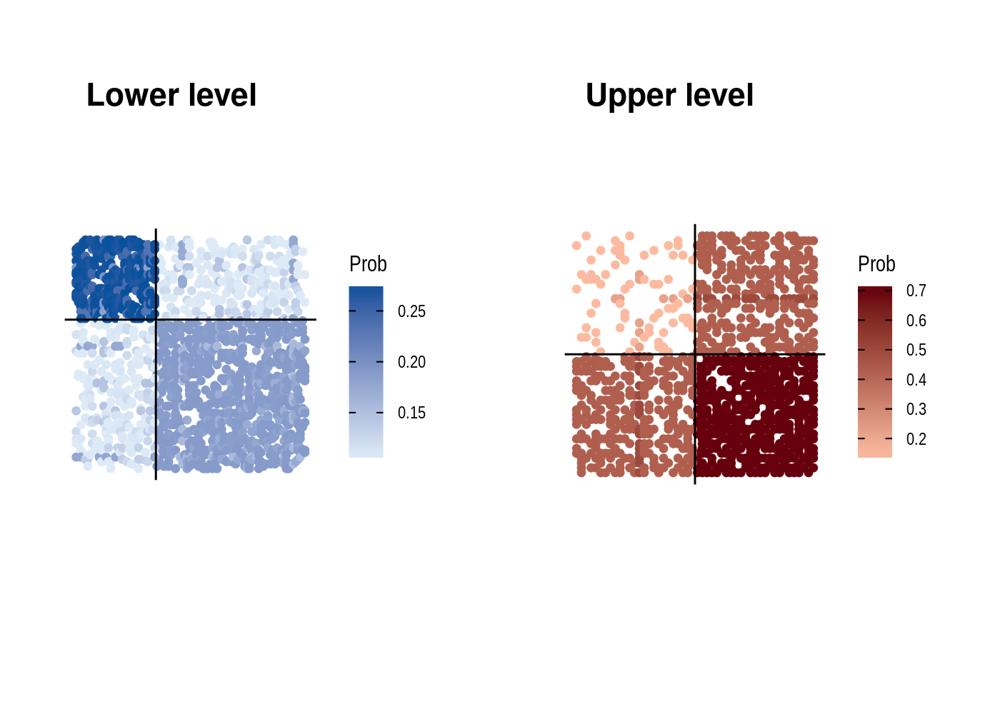

<!-- README.md is generated from README.Rmd. Please edit that file -->
MLVSBM
======

<!-- badges: start -->
[](https://travis-ci.org/Chabert-Liddell/MLVSBM) [](https://codecov.io/gh/Chabert-Liddell/MLVSBM?branch=master) <!-- badges: end -->

The goal of MLVSBM is to ...

Installation
------------

You can install the released version of MLVSBM from [github](https://github.com) with:

``` r
devtools::install_github("Chabert-Liddell/MLVSBM")
#> Skipping install of 'MLVSBM' from a github remote, the SHA1 (a46c108b) has not changed since last install.
#>   Use `force = TRUE` to force installation
```

Example
-------

This is a how to simulate a multilevel SBM network:

``` r
set.seed(1)
my_mlvsbm <- MLVSBM::mlvsbm_simulate_network(
  n = list(I = 100, O = 50), # Number of nodes for the lower level and the upper level
  Q = list(I = 2, O = 2), # Number of blocks for the lower level and the upper level
  pi = c(.7, .3), # Block proportion for the upper level, must sum to one
  gamma = matrix(c(.8, .1,  # Block proportion for the lower level,
                   .2, .9), # each column must sum to one
                 nrow = 2, ncol = 2, byrow = TRUE),  
  alpha = list(I = matrix(c(.1, .3, .3, .7), nrow = 2, ncol = 2), # Connection matrix
               O = matrix(c(.3, .1, .1, .3), nrow = 2, ncol = 2)),# between blocks
  directed = list(FALSE, FALSE), # Are the upper and lower level directed or not ?
  affiliation = "preferential", # How the affiliation matrix is generated
  no_empty_org = FALSE) # May the affiliation matrix have column suming to 0
```

This is how to create a network from data:

``` r
lower_level <- my_mlvsbm$adjacency_matrix$I
upper_level <- my_mlvsbm$adjacency_matrix$O
affiliation <- my_mlvsbm$affiliation_matrix
my_mlvsbm2 <- MLVSBM::mlvsbm_create_network(X = list(I = lower_level, O = upper_level),
                                            A = affiliation)
```

And this is how to infer it:

``` r
fit <- MLVSBM:::mlvsbm_estimate_network(my_mlvsbm)
#> [1] "Infering lower level :"
#> [1] "# cluster : 1, ICL = -2827.19879997479 !"
#> [1] "# cluster : 2, ICL = -2673.73197247247 !"
#> [1] "# cluster : 3, ICL = -2573.93888909764 !"
#> [1] "# cluster : 2, ICL = -2537.52497319022 !"
#> [1] "# cluster : 5, ICL = -2627.57154659853 !"
#> [1] "# cluster : 4, ICL = -2589.65848400725 !"
#> [1] "# cluster : 3, ICL = -2561.5901438226 !"
#> [1] "# cluster : 2, ICL = -2537.52497319022 !"
#> [1] "Infering upper level :"
#> [1] "# cluster : 1, ICL = -696.505166764901 !"
#> [1] "# cluster : 5, ICL = -786.896870045242 !"
#> [1] "# cluster : 4, ICL = -743.947048594974 !"
#> [1] "# cluster : 3, ICL = -711.634076920747 !"
#> [1] "# cluster : 2, ICL = -695.628094280905 !"
#> [1] "======= # Individual clusters : 2 , # Organisation clusters 2,  ICL : -3214.06915482752========"
#> [1] "======= # R clusters : 2 , # L clusters 2,  ICL : -3214.06915482752========"
#> [1] "ICL for independent levels : -3233.15306747112"
#> [1] "ICL for interdependent levels : -3214.06915482752"
#> [1] "=====Interdepence is detected between the two level====="
```

Ploting the results
-------------------

Some examples to plot synthetic view of the network

Plotting adjacency matrices reordered by block with the link probability of each observed link.

``` r
ggdraw()+
  draw_plot(
    t(fit$X_hat$I * lower_level) %>% 
      as_tbl_graph() %>% 
      mutate(group = fit$Z$I) %>% 
      ggraph('matrix', sort.by = group)+
      geom_edge_point(aes(color = weight))+
      scale_edge_color_gradient(name = 'Prob', low = "#deebf7", high = "#08519c") +
      geom_hline(yintercept = cumsum(table(fit$Z$I))[-fit$nb_clusters$I]+.5) +
      geom_vline(xintercept = cumsum(table(fit$Z$I))[-fit$nb_clusters$I]+.5) +
      scale_y_reverse() +
      coord_fixed() +
      theme_graph() , 0, 0, .5, 1
  ) +
  draw_plot(
    t(fit$X_hat$O * upper_level) %>% 
      as_tbl_graph() %>% 
      ggraph('matrix', sort.by = fit$Z$O) +
      geom_edge_point(aes(color = weight)) +
      geom_hline(yintercept = cumsum(table(fit$Z$O))[-fit$nb_clusters$O]+.5) +
      geom_vline(xintercept = cumsum(table(fit$Z$O))[-fit$nb_clusters$O]+.5) +
      scale_edge_colour_gradient(name = 'Prob',low = "#fcbba1", high = "#67000d") +
      scale_y_reverse() +
      coord_fixed() + 
      theme_graph(), x = 0.5, y = 0, width = .5, height = 1  
    ) +
  draw_plot_label(label = c("Lower level", "Upper level"), x = c(0, .5), y = c(.9, .9))
```



To plot a synthetic view of the interaction between block and between the two levels :

Some useful output
------------------

Output of the algorithm are stocked in the MLVSBM and FitMLVSBM objects. The MLVSBM objects stock information of the observed or simulated network and a list of all the fitted SBM and MLVSBM models.

``` r
my_mlvsbm$ICL # A data frame of the inferred models 
#> # A tibble: 1 x 4
#>   index   Q_I   Q_O    ICL
#>   <int> <int> <int>  <dbl>
#> 1     1     2     2 -3214.
my_fit <- my_mlvsbm$fittedmodels[[which.max(my_mlvsbm$ICL$ICL)]] # The fitted model with index  the highest ICL
my_mlvsbm$ICL_sbm # The ICL of the SBM
#> $lower
#>  [1] -2827.199 -2537.525 -2561.590 -2589.658 -2627.572      -Inf      -Inf
#>  [8]      -Inf      -Inf      -Inf
#> 
#> $upper
#>  [1] -696.5052 -695.6281 -711.6341 -743.9470 -786.8969      -Inf      -Inf
#>  [8]      -Inf      -Inf      -Inf
my_sbm_lower <- my_mlvsbm$fittedmodels_sbm$lower[[3]] # A fitted SBM for the lower level with 3 blocks
my_sbm_upper <- my_mlvsbm$fittedmodels_sbm$upper[[2]] # A fitted SBM for the upper level with 2 blocks
```

You can also get the parameters and the clustering of the fitted model as follows

``` r
fit$parameters # The connectivity and membership parameters of the model
#> $alpha
#> $alpha$I
#>           [,1]      [,2]
#> [1,] 0.6827351 0.2892846
#> [2,] 0.2892846 0.1128397
#> 
#> $alpha$O
#>           [,1]      [,2]
#> [1,] 0.3274623 0.1114549
#> [2,] 0.1114549 0.2214659
#> 
#> 
#> $pi
#> $pi$O
#> [1] 0.7999804 0.2000196
#> 
#> 
#> $gamma
#>           [,1]       [,2]
#> [1,] 0.2167992 0.93850848
#> [2,] 0.7832008 0.06149152
fit$Z # The membership of each nodes
#> $I
#>   [1] 2 2 2 1 1 2 2 1 2 1 1 1 1 2 1 2 1 1 2 2 1 1 2 2 2 1 2 1 2 1 2 2 2 2 2 2 1
#>  [38] 2 2 2 1 2 1 2 1 1 1 2 2 1 1 1 2 2 2 2 1 2 2 2 2 1 2 1 2 2 2 2 1 2 2 2 2 2
#>  [75] 1 2 1 2 2 2 2 1 2 1 1 2 2 2 1 2 2 2 2 2 2 2 2 2 2 2
#> 
#> $O
#>  [1] 1 1 2 1 1 1 2 1 1 1 1 1 1 1 1 1 2 1 1 1 2 1 1 1 1 1 2 1 1 2 1 2 1 1 1 1 1 1
#> [39] 1 1 1 1 1 2 1 2 2 1 1 1
fit$vbound # A vector of the varational bound of the VEM algorithm
#> [1] -3186.911 -3184.270 -3184.089 -3184.082 -3184.081 -3184.081 -3184.081
#> [8] -3184.081 -3184.081
tau <- fit$membership # The variational parameters of the model
pred <- fit$X_hat # The link prediction for each level
```
