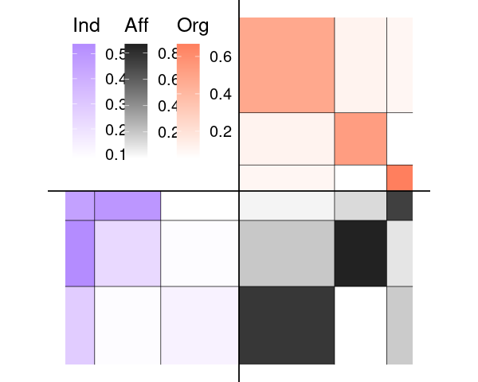

<!-- README.md is generated from README.Rmd. Please edit that file -->

# MLVSBM

<!-- badges: start -->

[](https://travis-ci.org/Chabert-Liddell/MLVSBM)
[](https://codecov.io/gh/Chabert-Liddell/MLVSBM?branch=master)
[](https://github.com/Chabert-Liddell/MLVSBM)
[](https://doi.org/10.1016/j.csda.2021.107179)
<!-- badges: end -->

This is an R package implementation of a Stochastic Block Model for
Multilevel Network (MLVSBM) as described in Chabert-Liddell, Barbillon,
Donnet and Lazega (2021) <https://doi.org/10.1016/j.csda.2021.107179>.

## Installation

You can install the released version of MLVSBM from
[github](https://github.com) with:

``` r
devtools::install_github("Chabert-Liddell/MLVSBM")
```

## Overview and examples

The package deals with multilevel network defined as the junction of two
interaction networks (adjacency matrices) linked by an affiliation
relationship (affiliation matrix).

First, we’re going to simulate a multilevel network with 100 individuals
and 3 clusters of individuals for the lower level and 50 organizations
and 3 clusters for the upper level. The inter-organizational level will
have an assortative structure and will be undirected, the
inter-individual’s one a core-periphery structure and will be directed.
Affiliation matrix will be generated by a power law and the dependence
between the structure of the two levels will be strong.

``` r
set.seed(123)
my_mlvsbm <- MLVSBM::mlvsbm_simulate_network(
  n = list(I = 60, O = 40), # Number of nodes for the lower level and the upper level
  Q = list(I = 3, O = 3), # Number of blocks for the lower level and the upper level
  pi = c(.5, .3, .2), # Block proportion for the upper level, must sum to one
  gamma = matrix(c(.8, .1, .1,  # Block proportion for the lower level,
                   .1, .8, .1,
                   .1, .1, .8), # each column must sum to one
                 nrow = 3, ncol = 3, byrow = TRUE),  
  alpha = list(I = matrix(c(.1, .1, .3, 
                            .1, .2, .5,
                            .1, .5, .5), 
                          nrow = 3, ncol = 3, byrow = TRUE), # Connection matrix
               O = matrix(c(.5, .1, .1, 
                            .1, .5, .1,
                            .1, .1, .5), 
                          nrow = 3, ncol = 3, byrow = TRUE)),# between blocks
  directed = list(I = TRUE, O = FALSE), # Are the upper and lower level directed or not ?
  affiliation = "preferential", # How the affiliation matrix is generated
  no_empty_org = FALSE) # May the affiliation matrix have column suming to 0
```

The network is stocked in an `R6` object of type `MLVSBM`.

Now, we are going to create a multilevel network object from 2 existing
adjacency matrix and an affiliation matrix :

``` r
lower_level <- my_mlvsbm$adjacency_matrix$I # matrix of size nI x nI
upper_level <- my_mlvsbm$adjacency_matrix$O # matrix of size nO x nO
affiliation <- my_mlvsbm$affiliation_matrix # matrix of size nI x nO
my_mlvsbm2 <- MLVSBM::mlvsbm_create_network(X = list(I = lower_level, O = upper_level),
                                            A = affiliation)
```

We can now infer the parameters, blocks and edge probabilities of our
network by using the `mlvlsbm_estimate_network()` function on an
`MLVSBM` object. It will return the best model for this network as
another R6 object of type `FitMLVSBM`.

``` r
fit <- MLVSBM:::mlvsbm_estimate_network(my_mlvsbm)
#> 
#> [1] "Infering lower level :"
#> [1] "# blocks: 3, ICL = -1752.99110620455 !"
#> 
#> [1] "Infering upper level :"
#> [1] "# blocks: 3, ICL = -429.333753035444 !"
#> [1] "======= # Individual clusters : 3 , # Organisation clusters 3,  ICL : -2161.21593501663========"
#> [1] "======= # Individual blocks : 3 , # Organizational blocks 3,  ICL : -2161.21593501663========"
#> [1] "ICL for independent levels : -2182.32485924"
#> [1] "ICL for interdependent levels : -2161.21593501663"
#> [1] "=====Interdependence is detected between the two levels!====="
```

## Exploring the results

Some generic functions allow an easy access to the most useful
parameters:

``` r
print(fit)
#> Multilevel Stochastic Block Model -- bernoulli variant
#> =====================================================================
#> Dimension = ( 60 40 ) - ( 3 3 ) blocks.
#> =====================================================================
#> * Useful fields 
#>   $independent, $distribution, $nb_nodes, $nb_clusters, $Z 
#>   $membership, $parameters, $ICL, $vbound, $X_hat
```

We can also plot a synthetic view of the network, with the fitted model:

``` r
plot(fit)
#> Joining, by = c("name", "group")
#> Joining, by = "name"
```



As well as obtain the model parameters:

``` r
coef(fit)
#> $alpha
#> $alpha$I
#>            [,1]      [,2]       [,3]
#> [1,] 0.23076927 0.5384598 0.09440602
#> [2,] 0.49679322 0.4545447 0.08333412
#> [3,] 0.09615434 0.2840906 0.13419909
#> 
#> $alpha$O
#>            [,1]       [,2]       [,3]
#> [1,] 0.66665873 0.09848632 0.05555697
#> [2,] 0.09848632 0.48051884 0.11363719
#> [3,] 0.05555697 0.11363719 0.53030085
#> 
#> 
#> $pi
#> $pi$O
#> [1] 0.1500005 0.5499994 0.3000001
#> 
#> 
#> $gamma
#>            [,1]      [,2]         [,3]
#> [1,] 0.09091169 0.1923087 8.695625e-01
#> [2,] 0.72726867 0.0384628 1.304356e-01
#> [3,] 0.18181964 0.7692285 1.956515e-06
```

And the prediction of the block clustering as well as the probability of
a link between two individuals or two organizations:

``` r
pred <- predict(fit)
pred$nodes
#> $I
#>  [1] 1 3 3 1 3 2 1 2 1 3 1 3 3 1 3 3 1 1 3 1 1 1 3 1 3 3 1 1 1 1 3 1 2 2 1 3 2 3
#> [39] 3 3 2 1 1 1 2 2 1 3 3 1 2 1 3 1 2 2 2 1 3 3
#> 
#> $O
#>  [1] 3 2 2 2 1 2 1 1 3 2 3 3 3 2 2 2 2 3 2 2 2 3 2 3 2 2 1 1 1 2 2 3 2 3 2 2 3 2
#> [39] 2 3
pred$dyads$I[1:5, 1:5]
#>           [,1]       [,2]       [,3]      [,4]       [,5]
#> [1,] 0.0000000 0.09440663 0.09440663 0.2307696 0.09440663
#> [2,] 0.0961551 0.00000000 0.13419912 0.0961551 0.13419912
#> [3,] 0.0961551 0.13419912 0.00000000 0.0961551 0.13419912
#> [4,] 0.2307696 0.09440663 0.09440663 0.0000000 0.09440663
#> [5,] 0.0961551 0.13419912 0.13419912 0.0961551 0.00000000
```

## Some others useful output

Output of the algorithm are stocked in the `MLVSBM` and `FitMLVSBM`
objects. The `MLVSBM` object stocks information of the observed or
simulated network and a list of all the fitted SBM and MLVSBM models.

``` r
my_mlvsbm$ICL # A data frame of the inferred models 
#>   index Q_I Q_O       ICL
#> 1     1   3   3 -2161.216
my_fit <- my_mlvsbm$fittedmodels[[which.max(my_mlvsbm$ICL$ICL)]] # The fitted model with index  the highest ICL
my_mlvsbm$ICL_sbm # The ICL of the SBM
#> $lower
#>  [1]      -Inf      -Inf -1752.991      -Inf      -Inf      -Inf      -Inf
#>  [8]      -Inf      -Inf      -Inf
#> 
#> $upper
#>  [1]      -Inf      -Inf -429.3338      -Inf      -Inf      -Inf      -Inf
#>  [8]      -Inf      -Inf      -Inf
my_sbm_lower <- my_mlvsbm$fittedmodels_sbm$lower[[3]] # A fitted SBM for the lower level with 3 blocks
my_sbm_upper <- my_mlvsbm$fittedmodels_sbm$upper[[2]] # A fitted SBM for the upper level with 2 blocks
```

You can also get the parameters and the clustering of the fitted model
from the `FitMLVSBM` object as follows:

``` r
fit$parameters # The connectivity and membership parameters of the model
#> $alpha
#> $alpha$I
#>            [,1]      [,2]       [,3]
#> [1,] 0.23076927 0.5384598 0.09440602
#> [2,] 0.49679322 0.4545447 0.08333412
#> [3,] 0.09615434 0.2840906 0.13419909
#> 
#> $alpha$O
#>            [,1]       [,2]       [,3]
#> [1,] 0.66665873 0.09848632 0.05555697
#> [2,] 0.09848632 0.48051884 0.11363719
#> [3,] 0.05555697 0.11363719 0.53030085
#> 
#> 
#> $pi
#> $pi$O
#> [1] 0.1500005 0.5499994 0.3000001
#> 
#> 
#> $gamma
#>            [,1]      [,2]         [,3]
#> [1,] 0.09091169 0.1923087 8.695625e-01
#> [2,] 0.72726867 0.0384628 1.304356e-01
#> [3,] 0.18181964 0.7692285 1.956515e-06
fit$Z # The membership of each nodes
#> $I
#>  [1] 1 3 3 1 3 2 1 2 1 3 1 3 3 1 3 3 1 1 3 1 1 1 3 1 3 3 1 1 1 1 3 1 2 2 1 3 2 3
#> [39] 3 3 2 1 1 1 2 2 1 3 3 1 2 1 3 1 2 2 2 1 3 3
#> 
#> $O
#>  [1] 3 2 2 2 1 2 1 1 3 2 3 3 3 2 2 2 2 3 2 2 2 3 2 3 2 2 1 1 1 2 2 3 2 3 2 2 3 2
#> [39] 2 3
fit$vbound # A vector of the varational bound of the VEM algorithm
#> [1] -2088.49
tau <- fit$membership # The variational parameters of the model
pred <- fit$X_hat # The links predictions for each level
```
